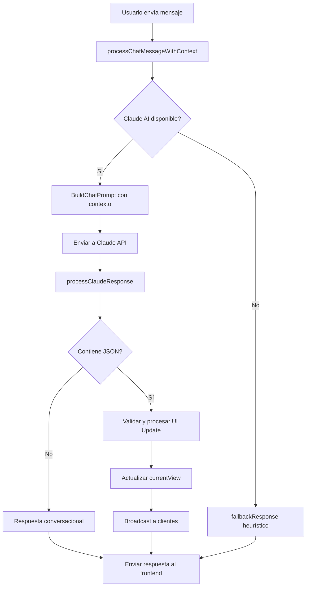

# Chat AI Integration con Claude

## 🎯 Objetivo Completado

El sistema de chat ahora usa **Claude AI** con **prompts estructurados** en lugar de heurísticas (`strings.Contains()`).

## 📋 Cambios Realizados

### 1. **Integración de Claude AI en PreviewServer**

**Archivo:** `internal/vibe/preview.go`

- ✅ **Agregado `claudeClient *ClaudeClient`** al struct PreviewServer
- ✅ **Inicialización automática** del cliente Claude en el constructor
- ✅ **Función `processChatMessageWithContext()` completamente reescrita**

**Antes (Heurístico):**

```go
switch {
case strings.Contains(lowerMessage, "hola"):
    return ChatResponseData{Response: "¡Hola!"}
case strings.Contains(lowerMessage, "agregar botón"):
    return ps.createContextualComponentResponse(...)
}
```

**Después (Claude AI):**

```go
func (ps *PreviewServer) processChatMessageWithContext(message string) ChatResponseData {
    if ps.claudeClient != nil && ps.promptLoader != nil {
        fullPrompt, err := ps.promptLoader.BuildChatPrompt(promptData)
        claudeResponse, err := ps.claudeClient.CreateMessage(messages)
        response := ps.processClaudeResponse(claudeResponse)
        return response
    }
    return ps.fallbackResponse(message)
}
```

### 2. **Procesamiento de Respuestas de Claude**

**Nuevas funciones implementadas:**

- ✅ **`processClaudeResponse()`** - Extrae JSON de respuestas de Claude
- ✅ **`handleUIUpdateFromClaude()`** - Procesa actualizaciones de UI
- ✅ **`addComponentFromClaude()`** - Agrega componentes desde Claude
- ✅ **`updateComponentFromClaude()`** - Actualiza componentes existentes
- ✅ **`updateThemeFromClaude()`** - Modifica temas desde Claude
- ✅ **`updateLayoutFromClaude()`** - Ajusta layouts desde Claude

### 3. **Mejoras en el Sistema de Prompts**

**Archivo:** `internal/vibe/prompts/system.md`

- ✅ **Sección "Your Role in Chat Mode"** - Contexto de conversación en vivo
- ✅ **Guías de respuesta estructuradas** - Ejemplos de respuestas con JSON
- ✅ **Uso del contexto del canvas** - Posicionamiento inteligente
- ✅ **Ejemplos de comandos comunes** - Casos de uso específicos

## 🔄 Flujo de Funcionamiento



## 🎨 Tipos de Respuestas

### **1. Respuestas Conversacionales**

Para preguntas generales, saludos, o información:

```
¡Hola! Veo que tienes 2 componentes en tu canvas con el tema océano.
¿Te gustaría agregar algo más?
```

### **2. Respuestas con Actualizaciones de UI**

Para comandos que modifican el canvas:

```
¡Perfecto! Agregando un botón azul en tu canvas.

{
  "type": "ui_update",
  "action": "add_component",
  "data": {
    "type": "button",
    "category": "atom",
    "properties": {
      "text": "Click me",
      "variant": "primary",
      "size": "medium"
    },
    "position": {"x": 200, "y": 200},
    "size": {"w": 160, "h": 40}
  },
  "explanation": "Agregué un botón azul interactivo"
}
```

## 📡 Integración con Frontend

### **Procesamiento de Mensajes**

El frontend procesa ambos tipos de respuesta:

- **Texto conversacional** → Se muestra en el chat
- **JSON de UI** → Se extrae y aplica al canvas

### **Tipos de Mensaje WebSocket**

```json
{
  "type": "chat_response",
  "data": {
    "response": "Mensaje de Claude",
    "action": "add_component",
    "data": {...},
    "timestamp": "2025-01-13T04:03:03Z"
  }
}
```

## 🚀 Beneficios del Nuevo Sistema

### **1. Inteligencia Contextual**

- Claude conoce el estado completo del canvas
- Posicionamiento inteligente de componentes
- Sugerencias basadas en el contexto actual

### **2. Respuestas Naturales**

- Conversaciones fluidas en español
- Explicaciones detalladas de los cambios
- Emojis y formato amigable

### **3. Flexibilidad**

- Maneja tanto UI updates como conversación general
- Fallback automático si Claude no está disponible
- Validación robusta de respuestas

### **4. Escalabilidad**

- Fácil agregar nuevos tipos de componentes
- Prompts modulares y extensibles
- Integración limpia con el sistema existente

## 🔧 Configuración

### **Variables de Entorno**

```bash
export ANTHROPIC_API_KEY=tu_clave_aqui
```

### **Ejecutar el Sistema**

```bash
./vibercode vibe
```

## 🎯 Resultado Final

El sistema ahora proporciona:

- ✅ **Chat AI real** con Claude API
- ✅ **Respuestas contextualmente inteligentes**
- ✅ **Actualizaciones de UI en tiempo real**
- ✅ **Fallback robusto** para casos sin API
- ✅ **Experiencia de usuario fluida**

El chat ya no depende de heurísticas simples, sino que usa la inteligencia de Claude para proporcionar respuestas más naturales y útiles.
